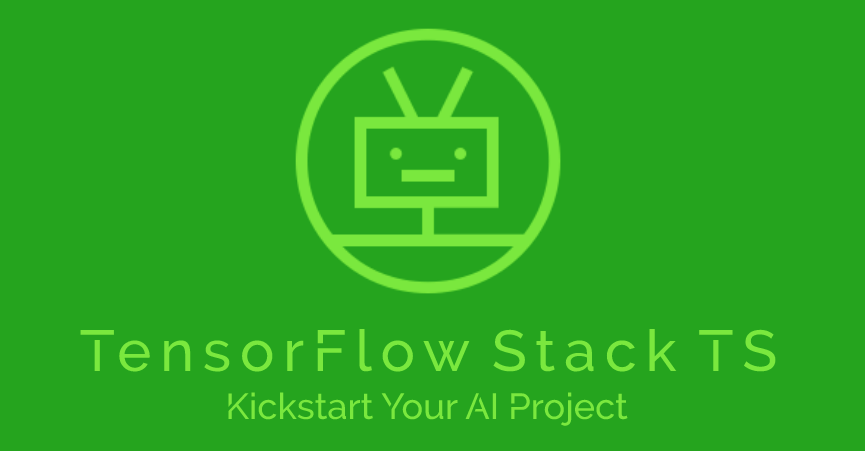
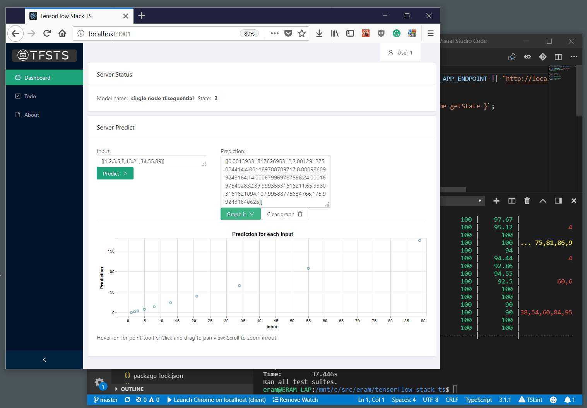

# TensorFlow-Stack-TS - Kickstart Your AI Project
TensorFlow.js Full-Stack Starter Kit



## Motivation 
Coming to work on an AI project there are [lots of things to consider](https://www.slideshare.net/ethanram/why-so-many-data-science-projects-fail-112757707), and getting some proof-of-concept going with a bunch of tools is the way to go. But once this phase of the project is over you want to develop an application or even just a testbed to work on. You need an applicative environment to develop on. Recently, when I tried setting up an application stack for an AI/TensoFlow based project, I found that the [MEAN](http://mean.io/)-based templates I used in the past are way behind and do not fully integrate the latest technologies. So I decided to put together the libraries I found working for me, as a new full-stack template. 

## Use cases?
Google's TensorFlow is run here inside a NodeJS environment - V8 single-threaded Javascript engine that is HW-accelerated with eighter WebGL or CUDA binaries. It seems that training a large-complex model on this environment is a no-go, even on a strong machine. But (1) using it to explore a model, visualize and adjust it's parameters is a good candidate. A more reasonable direction is to (2) take a large model built elsewhere, [convert it](https://github.com/tensorflow/tfjs-converter), and use this backend to serve clients' requests. It's easy to run such an app on the cloud/K8S and scale it horizontally.  
Regardless of the AI engine here, this is a (3) nicely integrated set of libraries and a modern developement environment to jumpstart any web/mobile/native project.

## What's in the box?
A well integrated, full-stack working sample:
- TensorFlow.js backend engine preloaded with a simple model to see it in action.
- Visualization library integrated into a responsive web/mobile application: a dashboard to exercise the above model and visualize its predictions.
- One coding language across the stack - TypeScript/Javascript fully ES6 with async/await across all code.
- Latest APIs based on a GraphQL schema.
- Modern dev tools with hot-reload on changes, linting, unit testing, and code coverage reports. Well integrated into VSCode as an IDE and debugger.
- [Keep it simple philosophy across](https://www.slideshare.net/ethanram/kissts-the-keep-it-simple-software-stack-for-2017-82329212)! I've saved a ton of learning-curve time by **not** including a bunch of libs that I found old-fashioned or cumbersome: Redux, Apollo server/client, Enzym, REST, yarn, Babel, Winston/Bunyan, Relay... 
- As a bonus, you get the trivial Todo application integrated here as well. So this can work for you "even" if this is not an AI-based project.



## Main integrated libraries in the stack

### Backend side
- [TensorFlow.js](https://js.tensorflow.org/) engine
- [GraphQL](http://graphql.org/) based API to feed the - [Node.JS](https://nodejs.org/en/)/[Typescript](https://www.typescriptlang.org/) environment and tooling with [mondemon](https://nodemon.io/)/hot-reloading
TFJS engine
- [KoaJS](https://koajs.com/) web-server, middleware and health-checks
- [typegql](https://prismake.github.io/typegql/) - Simplified GraphQL schema based on TypeScript annotations
- [GraphiQL](https://github.com/graphql/graphiql) in-browser IDE for exploring GraphQL schema
- [Dotenv-expand](https://github.com/motdotla/dotenv-expand) for environment-based config (see ```.env``` file)
- [Jest](https://basarat.gitbooks.io/typescript/docs/testing/jest.html) - unit tests with good coverage
- [VSCode](https://code.visualstudio.com/) launch settings

### Client side
- [Vega-lite](https://vega.github.io/vega-lite/) - for charting and visualizations
- [Ant Design/Typescript](https://ant.design/docs/react/introduce) React components - responsive dashboard
- [LESS/LCSS](http://lesscss.org/) - better styling
- [ts-fsm](https://github.com/eram/ts-fsm) - simplified state managenent for React
- [graphql-request](https://github.com/prisma/graphql-request) - simplified GraphQL client 
- [Jest](https://jestjs.io/docs/en/tutorial-react) - React-based unit tests
- Node.JS/Typescript tooling, including [webpack with babel and hot-module-replacement (HMR)](https://webpack.js.org/concepts/hot-module-replacement/)
- Client is based on react-create-app with [antd-demo](https://ant.design/docs/react/use-with-create-react-app) scripts and is not ejected.

## Main POIs
The repo is divided into a server-side (backend) project and a client-side (frontend) project. The Backend runs the TensorFlow model and an API to call it. The Client is a single-page responsive-app that calls the model, thru the API, and presents a graph of the results.
1. TensorFlow model is implemented in ```src/tensorFlowProvider``` folder as a 'Model Provider'. It follows a simple init >> train >> compile >> predict workflow. It is easy to implement a similar provider based on some other AI engine if a different one is needed.
1. The client side of the model is implemented in ```client/src/components/server-predict-card```. Where you can find an input-output form, a visualizations panel and a small model to drive them. The Visualization panel specification is found in ```VegaLiteSpec``` file. You can find a bunch of examples for charting specs on the [Vega site](https://vega.github.io/editor/#/examples/vega-lite/point_2d).
1. The Backend API implements on a GraphQL Schema in ```src/graphqlApi``` and served with a Schema Browser (dev builds only).
1. The client side of the API is implemented as a general-purpose GraphQL client in ```client/src/utils/graphqlQuery``` and a bunch of interfaces in ```client/src/components/graphql-types```.
1. Performance: As noted above, TensorFlow.js on the backend a very different animal than the "standard" TF-Python based environment. I could not find good benchmarks. Happy if you refer me or test yourself.

## Prerequisites
- NodeJS 8+ installed locally
- Git, VSCode or just a terminal
- ```npm install -g create-react-app react-app-rewired```

## Start developing!

```
> git clone https://github.com/eram/tensorflow-stack-ts.git stack
> cd stack
> npm install 
> npm start
> cd client
> npm install
> npm start
```

## Todo:
- [x] Hoveron and zoom in chart
- [ ] Add model training page next to dashboard
- [ ] TFJS to use tfjs-node (canvas/WebGL based) and/or CUDA libraries
- [ ] Load client input from csv/file upload
- [x] Join client and server into one repo.
- [ ] TLS cert and serve https
- [ ] Add DB model based on  for backend input/output stores
- [ ] Add DB interafce (SQLite for local-dev, PostgreQLs for prod)
- [ ] Dockerize and integrate into Google devops stack
- [ ] PM2 config script and PMX integration: cluster manager, central logging, central counters, hot environment changes and health-checks.
- [ ] User management and JWT
- [ ] Implement error-chain across API data-flow instead of using throws.
- [ ] Auto patch level versioning on build
- [ ] Replace nodemon with ts-node-dev (don't restart the server on file change).

## Troubleshhting - escalation path
_!!! In general, I highly advise you not to mess around with the json conf files. it's fragile... better UNDO!_
```
> npm run clean
> npx jest --clearCache
> rimraf node_modules
> rimraf package-lock.json
> Slide back to a known-to-be-working time and ``npm install``
> npm cache clean --force
```

Happy to get remarks, assistance with getting the todos done, [issues and pull-requests](https://github.com/eram/tensorflow-stack-ts/issues). Also happy to share admin and get more devs on board. If you need some consultation with your project - talk to me. 

Cheers!

eram at weblegions dot com
